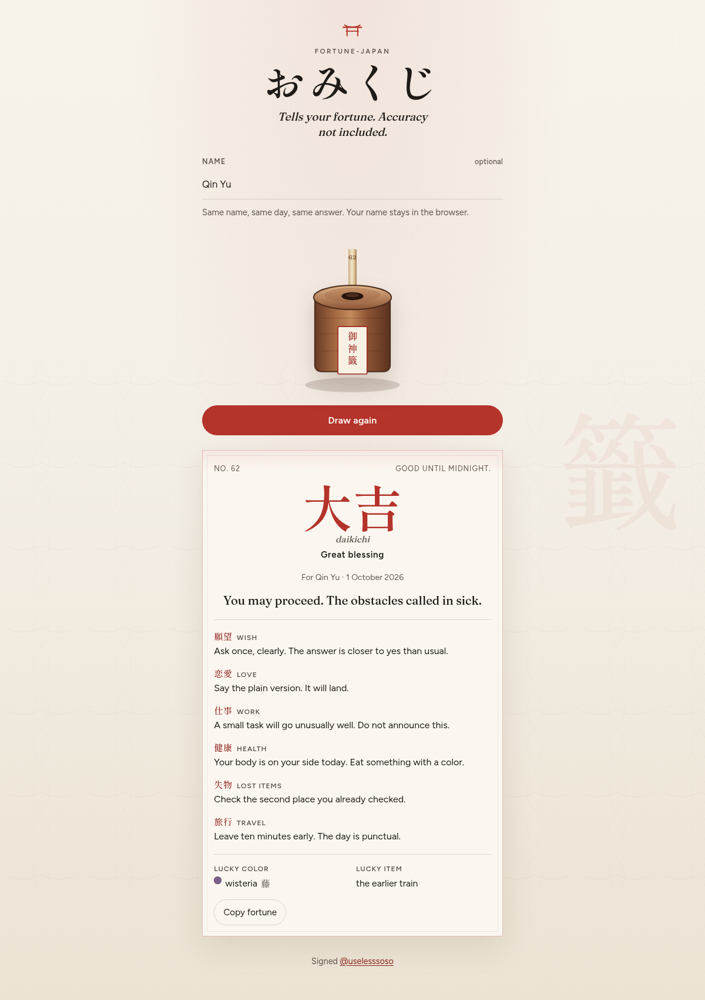

# fortune-japan

Tells your fortune. Accuracy not included.



A small omikuji (おみくじ) you draw in the browser. Seven classic ranks, from 大吉 down to 大凶, across wish, love, work, health, lost items, and travel. Shake the box, pull a stick, read the slip.

Give it a name and the answer stays fixed until midnight on your calendar. Leave the name blank and every draw is new. Nothing is stored and nothing is sent. A lucky color and a lucky item come with the slip, in case you wanted one more useless thing.

## Run locally

Open `index.html`, or from this folder:

```bash
python3 -m http.server 4173
```

Then visit `http://localhost:4173`.

## Deploy to GitHub Pages

`.github/workflows/pages.yml` publishes the site on every push to `main`.

After merging, enable it once:

1. Open **Settings → Pages**.
2. Under **Build and deployment**, set **Source** to **GitHub Actions**.

The site will be at `https://uselesssoso.github.io/fortune-japan/`.

## License

[MIT](LICENSE) © uselesssoso

Signed [@uselesssoso](https://github.com/uselesssoso)
